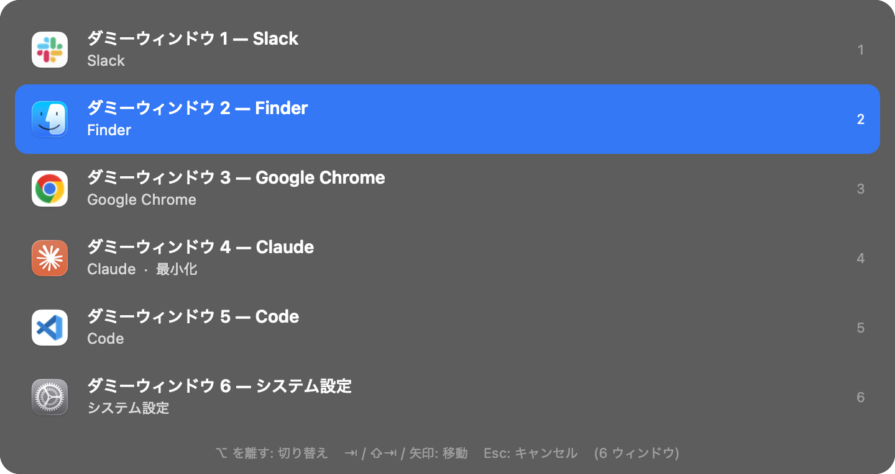

# alt-tab-mac

macOS で Windows 風の **Alt(Option)+Tab によるウィンドウ切り替え** を実現する、軽量な常駐アプリです。

macOS 標準の ⌘+Tab は「アプリ単位」の切り替えですが、このアプリは **ウィンドウ単位** で一覧を表示し、
キーボードだけで目的のウィンドウを選べます。Mission Control / Exposé は使いません。



## 特徴

- ⌥+Tab で全アプリのウィンドウ一覧を表示、⌥ を離すと切り替え（Windows と同じ操作感）
- 一覧は「最近使った順」。初期選択は直前のウィンドウなので、⌥+Tab をポンと押すだけで直前に戻れる
- 最小化されたウィンドウ、非表示 (⌘H) のアプリ、別の Space のウィンドウも一覧に出て、選ぶと復元される
- 修飾キーを Option / Control / Command から選べる
- メニューバー常駐、ログイン時起動の切り替えあり
- 依存ライブラリなし。Swift ソース 5 ファイル、`swiftc` だけでビルドできる

## 動作環境

- macOS 13 以降（macOS 26 で動作確認）
- Apple Silicon（Intel Mac で使う場合は `build.sh` の `-target` を変更してユニバーサルビルドにしてください）
- ビルドには Xcode Command Line Tools が必要（`xcode-select --install`）

## インストール

```bash
git clone https://github.com/moritalous/alt-tab-mac.git
cd alt-tab-mac
./install.sh
```

`install.sh` はビルドして `~/Applications/AltTabMac.app` にコピーし、起動します。

起動するとアクセシビリティ許可のダイアログが出るので、
**システム設定 > プライバシーとセキュリティ > アクセシビリティ** で `AltTabMac` を **オン** にしてください。
再起動は不要で、許可した瞬間から ⌥+Tab が使えるようになります。

ログイン時に自動起動したい場合は、メニューバーの `⌥⇥` → **ログイン時に起動** をオンにしてください。

## 使い方

| 操作 | 動作 |
|---|---|
| ⌥ + Tab | ウィンドウ一覧を表示し、次のウィンドウを選択 |
| ⌥ + Shift + Tab | 前のウィンドウを選択 |
| ⌥ を押したまま Tab 連打 / ↑ ↓ ← → | 選択を移動 |
| ⌥ を離す / Return / Space | 選択したウィンドウに切り替え |
| Esc | キャンセル |

メニューバーの `⌥⇥` アイコンから次の操作ができます。

- アクセシビリティ許可の状態確認（未許可ならクリックで設定画面を開く）
- ショートカットの修飾キー変更（Option / Control / Command）
- ログイン時に起動のオン / オフ
- 終了

## 再ビルド時の注意

このアプリは ad-hoc 署名（開発者証明書なし）です。ビルドし直すとバイナリのハッシュが変わり、
既存のアクセシビリティ許可が無効になります。`install.sh` は次の処理で自動的に再登録させます。

```bash
tccutil reset Accessibility local.kazuaki.AltTabMac
```

手動でビルド・コピーした場合は、上のコマンドを実行してからアプリを起動し直し、許可を付け直してください。
システム設定の一覧で AltTabMac を「−」で削除して「+」で追加し直しても同じです。

## 別の Mac で使う・配布する

- **ソースを渡して `./install.sh`** が一番簡単です（Xcode Command Line Tools が必要）。
- `.app` をそのまま渡すと Gatekeeper に止められます。受け取った側は
  システム設定 > プライバシーとセキュリティ の「このまま開く」を押すか、
  `xattr -d com.apple.quarantine ~/Applications/AltTabMac.app` で隔離属性を外してください。
- どの Mac でも、そのマシンごとにアクセシビリティ許可が必要です。
- 不特定多数に配布するには Apple Developer Program の Developer ID 署名と公証が必要です。

## 仕組み

- `CGEvent` のイベントタップで修飾キー+Tab を横取りし、他のアプリには渡さない
- Accessibility API (`AXUIElement`) で全アプリのウィンドウを列挙し、
  `CGWindowListCopyWindowInfo` の前面順（＝最近使った順）に並べる
- 切り替えは SkyLight の非公開 API `_SLPSSetFrontProcessWithOptions` と `AXRaise` を組み合わせて、
  「そのウィンドウだけ」を確実に前面化する

### 非公開 API について

次の 2 つは Apple がドキュメント化していない関数です。OSS の AltTab や yabai など同種のツールが広く使っている実績ある手法ですが、
将来の macOS アップデートで動かなくなる可能性があります。また、これを使うアプリは App Store には出せません。

| 関数 | 用途 |
|---|---|
| `_AXUIElementGetWindow` | AX のウィンドウ要素から `CGWindowID` を取得し、前面順と結びつける |
| `_SLPSSetFrontProcessWithOptions` / `SLPSPostEventRecordTo` | macOS 14 以降でバックグラウンドから確実に特定ウィンドウを前面化する |

## 注意点・制限

- ⌥+Tab を全アプリから奪います。ブラウザの「ページ内フォーカス移動」など、⌥+Tab を使う機能は使えなくなります。
  困る場合はメニューバーから Control / Command に変更してください。
- アクセシビリティ許可はすべてのキー入力を監視できる強い権限です。本アプリは入力の記録や送信は一切行いません。
- 一覧を出す瞬間に全アプリへ問い合わせます。応答しないアプリがあると、1 アプリあたり最大 0.3 秒待ちます。
- 一覧表示中はキー入力をすべて吸い込みます。Esc で閉じれば元に戻ります。
- ログイン時起動はアプリのパスを記憶します。`~/Applications` から移動した場合は、一度オフにしてからオンにし直してください。

## トラブルシューティング

**⌥+Tab が反応しない（アプリ内の項目移動になる）**

アクセシビリティ許可が古いビルドに紐づいている可能性が高いです。「再ビルド時の注意」の手順で許可を付け直してください。

**動作ログを見る**

```bash
log show --predicate 'process == "AltTabMac"' --last 10m --style compact | grep AltTabMac
```

起動時に `accessibility trusted=1` と `event tap start: OK` が出ていれば正常です。

**検出されるウィンドウ一覧を表示する**（アクセシビリティ許可が必要）

```bash
~/Applications/AltTabMac.app/Contents/MacOS/AltTabMac --list
```

**パネルの見た目だけ確認する**（権限不要、`--demo-out` で PNG 書き出し）

```bash
~/Applications/AltTabMac.app/Contents/MacOS/AltTabMac --demo --demo-out /tmp/panel.png
```

## アンインストール

1. メニューバーの `⌥⇥` → **AltTabMac を終了**
2. `~/Applications/AltTabMac.app` を削除
3. システム設定 > プライバシーとセキュリティ > アクセシビリティ の一覧から AltTabMac を削除
4. 設定を消す場合: `defaults delete local.kazuaki.AltTabMac`

システムの設定ファイルや他のアプリには一切変更を加えていません。

## ファイル構成

```
Sources/main.swift          エントリポイント（--list / --demo の処理を含む）
Sources/AppDelegate.swift   メニューバー、アクセシビリティ許可の監視
Sources/Switcher.swift      キー入力の監視と切り替えの状態管理
Sources/SwitcherPanel.swift ウィンドウ一覧パネルの UI
Sources/WindowManager.swift ウィンドウの列挙・並び替え・前面化
Info.plist                  アプリバンドルの設定（LSUIElement で Dock 非表示）
build.sh                    build/AltTabMac.app をビルド
install.sh                  ビルドして ~/Applications にインストール・起動
```

## より高機能なものが欲しい場合

OSS の [AltTab](https://alt-tab-macos.netlify.app/)（`brew install --cask alt-tab`）は、ウィンドウのサムネイル表示など
Windows により近い体験を提供します。本アプリはその軽量・自作版です。

## ライセンス

MIT License
